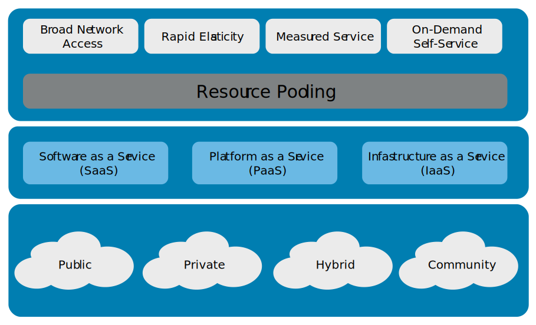

# Cloud Computing
Many organisations have moved from hard wired servers to operations that are run by cloud based facilities, because they provide both security and flexibility

Cloud computing is usually associated with an internet-based set of **computing resources**, and typically sold as a service, provided by a cloud service provider (CSP). 

Cloud Computing is very similar to the electrical or power grid. 

a model for enabling ubiquitous, convenient, on-demand network access to a shared pool of configurable computing resources (such as networks, servers, storage, applications, and services)that can be rapidly provisioned and released with minimal management effort or service provider interaction.

# Cloud Characteristics (Resource Pooling)
Cloud-based assets include any resources that an organization accesses using cloud computing.

Cloud computing has many benefits for organizations, which include but are not limited to: 
- Usage is metered and priced according to units (or instances) consumed. This can also be billed back to specific departments or functions.
- Reduced cost of ownership. There is no need to buy any assets for everyday use, no loss of asset value over time and a reduction of other related costs of maintenance and support.
- Reduced energy and cooling costs, along with “green IT” environment effect with optimum use of IT resources and systems.
- Allows an enterprise to scale up new software or data-based services/solutions through cloud systems quickly and without having to install massive hardware locally.

# Service Models
Some cloud-based services only provide data storage and access. When storing data in the cloud, organizations must ensure that security controls are in place to prevent unauthorized access to the data. 

There are varying levels of responsibility for assets depending on the service model. This includes maintaining the assets, ensuring they remain functional, and keeping the systems and applications up to date with current patches. In some cases, the cloud service provider is responsible for these steps. In other cases, the consumer is responsible for these steps. 

Type of Cloud computing service models:
1. **Software as a Service (SaaS)** - provides access to software applications but not the equipment necessary for customers to build and operate their own software.
2. **Platform as a Service (PaaS)** - provides a set of software building blocks and development tools, such as programming languages and supporting a run-time environment, that facilitate the construction of high-quality, scalable applications.
3. **Infrastructure as a Service (IaaS)** - provides use of hardware and related equipment that is retained by the provider but does not allow customers to build and operate their own software in the most suitable way, since it would also require them to manage the operating systems as well.

# Deployment Models
There are 4 cloud deployment models
1. **Private** - instead of shared with public they are private
2. **Public** - a shared resource that many people will be able to use as part of a resource pool
3. **Hybrid** - a combined form of private and public cloud
4. **Community** - they can be public or private, they are genarally designed for a particular community. The idea behind the community cloud is that people of like minds or similar interests can get together

## Managed Service Provider (MSP)
Company that manages information technoogy assets for another company
Organizations may also use an MSP to provide network and security monitoring and patching services
Today, many MSPs offer cloud-based services augmenting SaaS solutions with active incident investigation and response activities

## Service Level Agreement (SLA)
agreement between a cloud service provider and a cloud service customer based on a taxonomy of cloud computing– specific terms to set the quality of the cloud services delivered

Think of a rule book and legal contract—that combination is what you have in a service-level agreement (SLA)

The purpose of an SLA is to document specific parameters, minimum service levels and remedies for any failure to meet the specified requirements

SLA points to consider include the following:

Cloud system infrastructure details and security standards
Customer right to audit legal and regulatory compliance by the CSP         
Rights and costs associated with continuing and discontinuing service use
Service availability
Service performance
Data security and privacy
Disaster recovery processes
Data location
Data access
Data portability
Problem identification and resolution expectations
Change management processes
Dispute mediation processes
Exit strategy 
