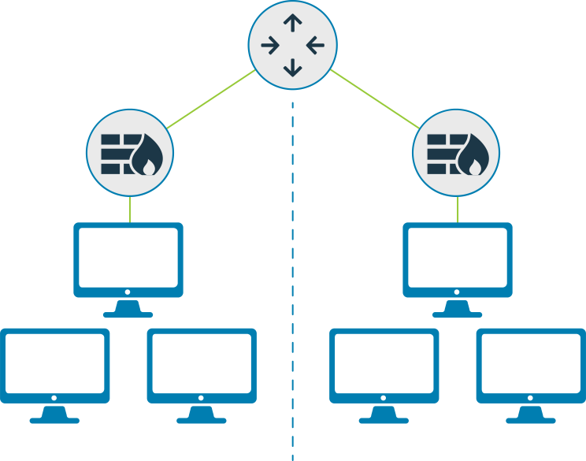
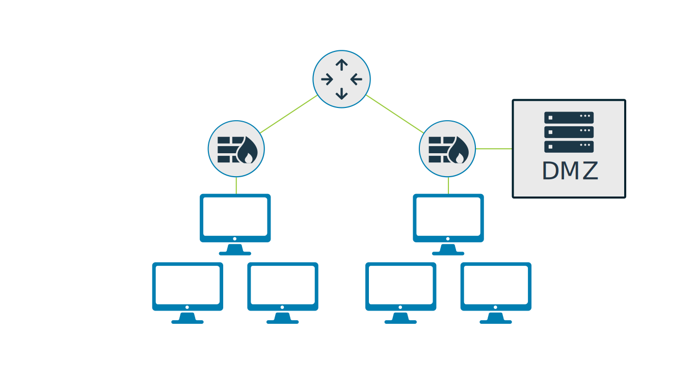
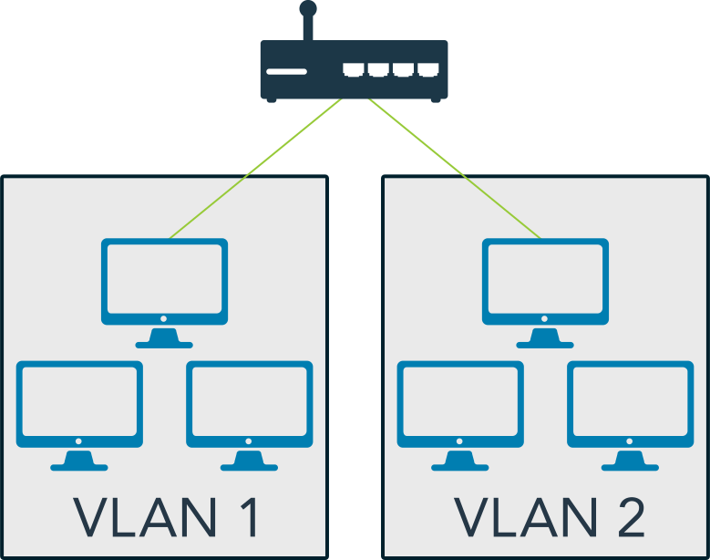
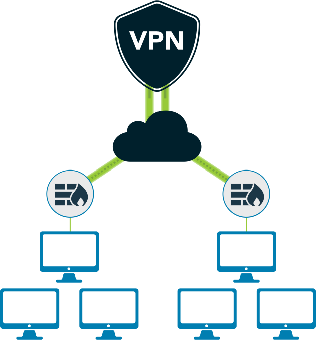
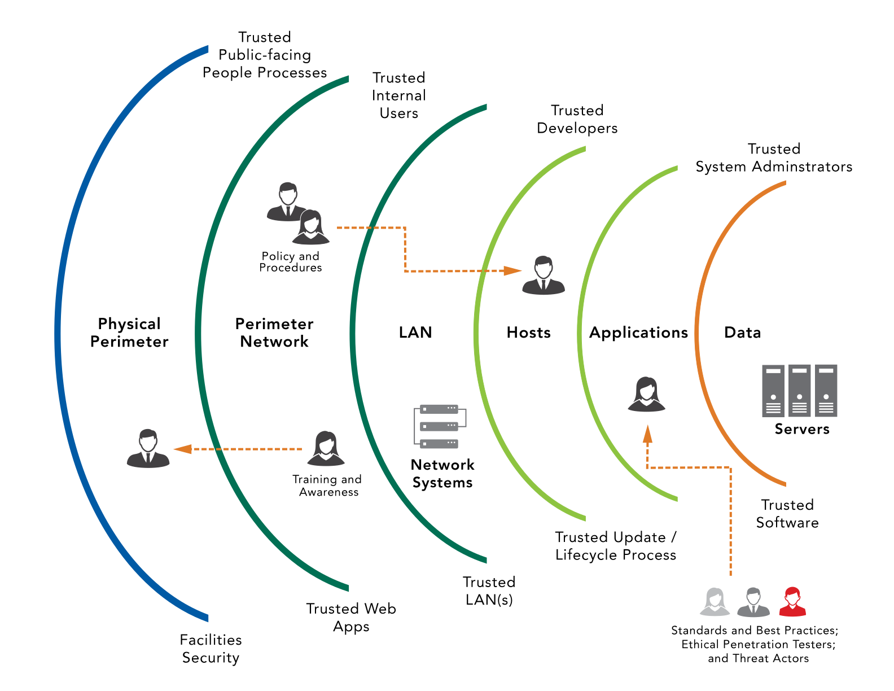
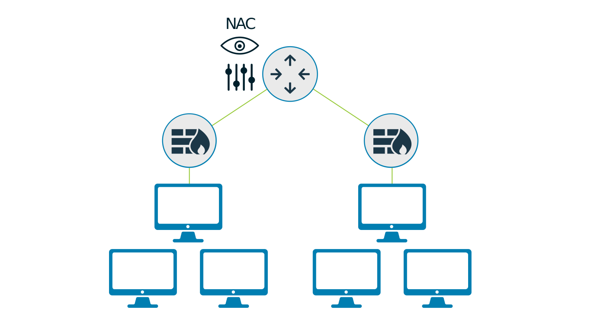

# Network Design

## Network Segmentation
Controlling traffic among networked devices. Complete or physical network segmentation occurs when a network is isolated from all outside communications, so transactions can only occur between devices within network

## DMZ (Demilitarized Zone)
network area that is designed to be accessed by outside visitors but is still isolated from the private network of the organization

The DMZ is often the host of public web, email, file and other resource servers.

For example, in a hospital or a doctor's office, you would have a segregated network for the patient inoformation and billing, and on the other side would be the electronic medical records.
If they are using a web-based application for medical record services, they would have a DMZ or segmented areas. And perhaps even behind the firewall, they have their own specified server to protect the critical information and keep it segregated.

Some application use **WAF** (Web Application Firewall) rather than a DMZ network.

The WAF has an internal and an external connection like a traditional firewall, with the external traffic being filterd by the traditional ro next generation firewall first. It monitors all traffic, encrypted or not, from the outside for malicious behaviour before passing commands to a web server that may be internal to the network

## VLAN
VLANs are created by switches to logically segment a network without altering its physical topology. But VLANs are also probed to attacks such as VLAN hopping which allow malicious attacker to capture traffic.

These VLANs are maily used to limit broadcast traffic, by segregating network segments.

Common practices of VLANs are

- Seperate VoIP telephone from corporate network
- Seperate Data center from all other network.

This makes it easier to keep the server to server traffic contained to the data center network while allowing certain traffic from workstations or the web to access the servers.

The most important thing to remember is that while VLANs are logically seperated, they may be allowed to access other VLANs. They can also be configured to deny access to other VLANs.

## VPN
communication tunnel that provides point-to-point transmission of both authentication and data traffic over an untrusted network.

A virtual private network (VPN) is not necessarily an encrypted tunnel. It is simply a point-to-point connection between two hosts that allows them to communicate.

Secure communications can, of course, be provided by the VPN, but only if the security protocols have been selected and correctly configured to provide a trusted path over an untrusted network, such as the internet.

As an alternative to expensive dedicated point-to-point connections, organizations use gateway-to-gateway VPNs to securely transmit information over the internet between sites or even with business partners.

## Defence in Depth
Defense in depth uses multiple types of access controls in literal or theoretical layers to help an organization avoid a monolithic security stance.

## Network access control
Network access control (NAC) is a concept of controlling access to an environment through strict adherence to and implementation of security policy.

These systems use VLANs to control whether devices connect to the corporate network or to a guest network. Even though a wireless access controller may attach to a single port on a physical network switch, the VLAN associated with the device connection on the wireless access controller determines the VLAN that the device operates on and to which networks it is allowed to connect.

