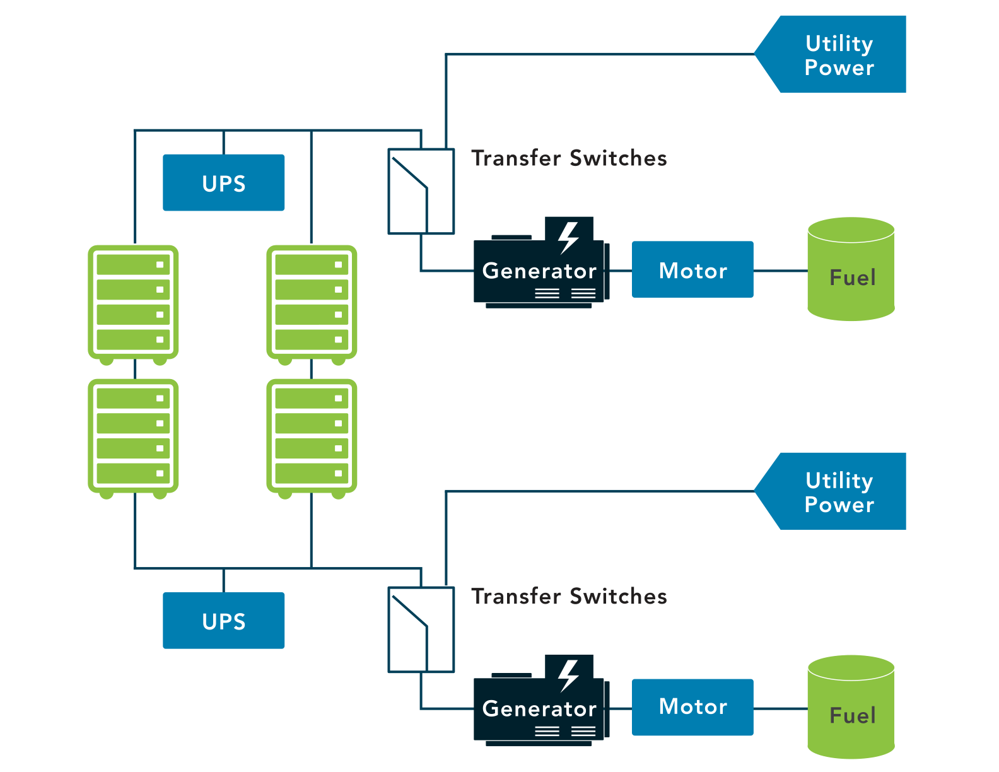

# Data Centers and Cloud

## On Premises Data Centers
When it comes to data centers, there are two primary options: organizations can outsource the data center or own the data center

If the data center is owned then it will be likely build on premises.

### Data center or Closets
The facility wiring infrastructure is integral to overall information system security and reliability. Protecting access to the physical layer of the network is important in minimizing intentional or unintentional damage. Proper protection of the physical site must address these sorts of security challenges. Data centers and wiring closets may include the following:

Phone, network, special connections
ISP or telecommunications provider equipment
Servers
Wiring and/or switch components

### Heating, Ventilation and Air Conditioning (HVAC) / Environmental
High-density equipment and equipment within enclosed spaces requires **adequate cooling** and **airflow**. Well-established standards for the operation of computer equipment exist, and equipment is tested against these standards. For example, the recommended range for optimized maximum uptime and hardware life is from **64° to 81°F (18° to 27°C)**, and it is recommended that a rack have three temperature sensors, positioned at the top, middle and bottom of the rack, to measure the actual operating temperature of the environment. Proper management of data center temperatures, including cooling, is essential.

Cooling is not the only issue with airflow: Contaminants like dust and noxious fumes require appropriate controls to minimize their impact on equipment. Monitoring for water or gas leaks, sewer overflow or HVAC failure should be integrated into the building control environment, with appropriate alarms to signal to organizational staff. Contingency planning to respond to the warnings should prioritize the systems in the building, so the impact of a major system failure on people, operations or other infrastructure can be minimized.

Power backups are neccessary for data centers as they require boat loads of energy as abnormal shutdown could lead to corrupt data or data loss

***

## Redundancy
The concept of redundancy is to design systems with duplicate components so that if a failure were to occur, there would be a backup.

Risk assessments pertaining to the data center should identify when multiple separate utility service entrances are necessary for redundant communication channels and/or mechanisms.  

If the organization requires full redundancy, devices should have two power supplies connected to diverse power sources.

## Memorandum of Understanding (MOU)/Memorandum of Agreement (MOA) 
Some organizations seeking to minimize downtime and enhance BC (Business Continuity) and DR (Disaster Recovery) capabilities will create agreements with other, similar organizations.

They agree to share resources if one party fails to make ends meet with their availability.

These agreements are called joint operating agreements (JOA) or memoranda of understanding (MOU) or memoranda of agreement (MOA). 

The difference between an MOA or MOU  and an SLA (Service Level Agreement) is that a Memorandum of Understanding is more directly related to what can be done with a system or the information.