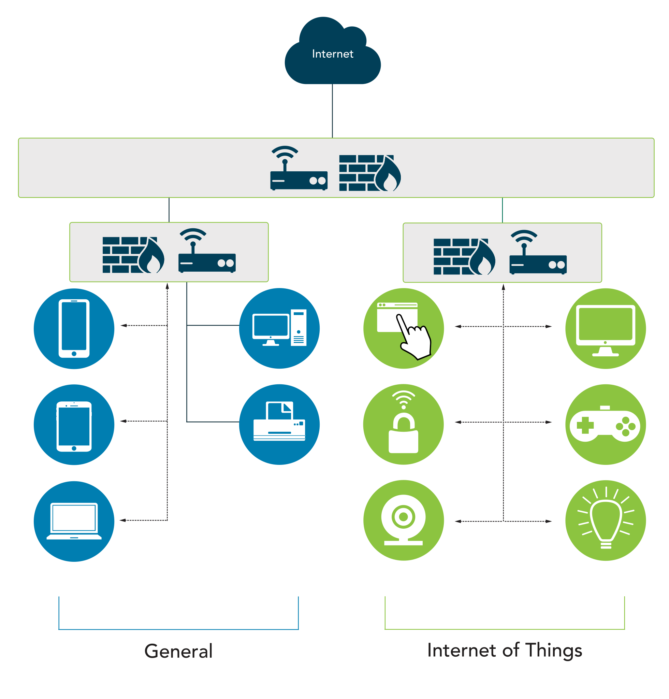

# Segmentation for Embedded Systems and IoT
An embedded system is a computer implemented as part of a larger system. The embedded system is typically designed around a **limited set of specific functions** in relation to the **larger product of which it is a component**. 

Examples of embedded systems include network-attached printers, smart TVs, HVAC controls, smart appliances, smart thermostats and medical devices. 

Network-enabled devices are any type of portable or nonportable device that has native network capabilities. Which includes most of our daily usage devices

Embedded systems and network-enabled devices that communicate with the internet are considered IoT devices and need special attention to ensure that communication is not used in a malicious manner

Since many of these devices have multiple access routes, such as ethernet, wireless, Bluetooth, etc., special care should be taken to isolate them from other devices on the network.

