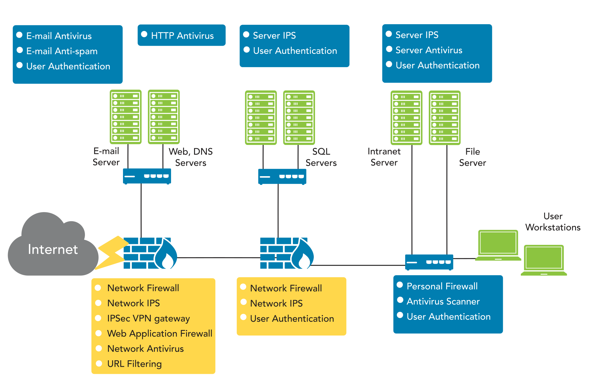

# Zero Trust
Networks that are often microsegmented network, with firewalls at nearly every connecting point

Refer to the EDU-CC-exam_domain_chapter_map.pdf for additional info, find it in the assets folder