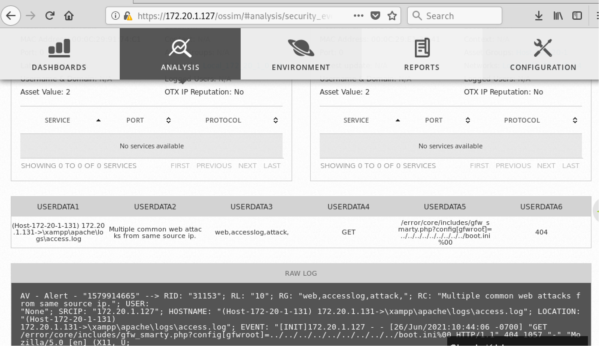

# Data Handling
Data itself goes through its own life cycle as users create, use, share and modify it

(ISC)2 Data handling model -> Create, Store, Use, Share, Archive, Destroy

USA - OSHA - Protects the well being of workers
Medical - HIPAA - Medical records storage regulations
Payment - PCI DSS - Securing credit card information
Europe - GDPR - handling of financial data

We need to be aware of any and all regulations that effect us.

Retention is how long we store the information and where, based on the requirement of our organisation or regulatory agencies as well.

Normal removal of virtual bins isn't the process of destroying the data entirely. **Degaussing** is the process of reducing or eliminating an unwanted magnetic field (or data) stored on tape and disk media

## Audits
Audits are a way to measure compliance with policy, but do not normally influence the **retention policy** itself. Organizations must maintain adherence to retention policy for logs as prescribed by law, regulations and corporate governance.

A **retention policy** (also called a 'schedule') is a key part of the lifecycle of a record. It describes how long a business needs to keep a piece of information (record), where it's stored and how to dispose of the record when its time.

# Data Handling Practices
## Classification
Businesses know the importance of information in todays world, so they classify it. These classifications dictate rules and restrictions about how that information can be used, stored or shared with others.

Classification is the process of recognizing the organizational impacts if the information suffers any security compromises related to its characteristics of confidentiality, integrity and availability. Information is then labeled and handled accordingly. 

Classifications are derived from laws, regulations, contract-specified standards or other business expectations.

## Labeling
Security labels are part of implementing controls to protect classified information.

It is reasonable to want a simple way of assigning a level of sensitivity to a data asset, such that the higher the level, the greater the presumed harm to the organization, and thus the greater security protection the data asset requires.

These labels must have precise boundaries to indicate the sesistivity of the label.

### Data Sensitivity Levels and Labels 

1. Highly Restricted
2. Moderately Restricted
3. Low Sesistivity
4. Unrestricted Public Data

# Logging and Monitoring Security Events
Logging is the primary form of instrumentation that attempts to capture signals generated by events.

Events are any actions that take place within the systems environment and cause measurable or observable change in one or more elements or resources within the system.

Logging imposes a computational cost but is invaluable when determining accountability. Proper design of logging environments and regular log reviews remain best practices regardless of the type of computer system. 

Major controls frameworks emphasize the importance of organizational logging practices.

User ID, System Activities, Date Time and key events, device and location Identity, Successful and Rejected system and resource access attempts and system configuration changes and system protection activation and deactivation events are some common information that needs to be logged in.

Health Info logging - identify inefficient or improper systems

**Log reviews** are an essential function not only for security assessment and testing but also for identifying security incidents, policy violations, fraudulent activities and operational problems near the time of occurrence.

Controls are implemented to protect against unauthorized changes to log information.

# Data Security Example

# Best Practices for logging Events
**Ingress monitoring** refers to surveillance and assessment of all **inbound communications** traffic and access attempts.

Firewall, Gateways, Remote Authentication Servers, IDS/IPS tools, SIEM solutions and Anti Malware solutions are some of devices and tools that offer logging and alerting oppurtunities.

**Egress monitoring** is used to regulate **data leaving the organization’s** IT environment.The term currently used in conjunction with this effort is **data loss prevention (DLP)** or **data leak protection**.

Emails (Content and Attachments), Copy to portable media, File Transfer Protocol, Posting to web pages/websites and APIs are some commonly inspected through DLP.