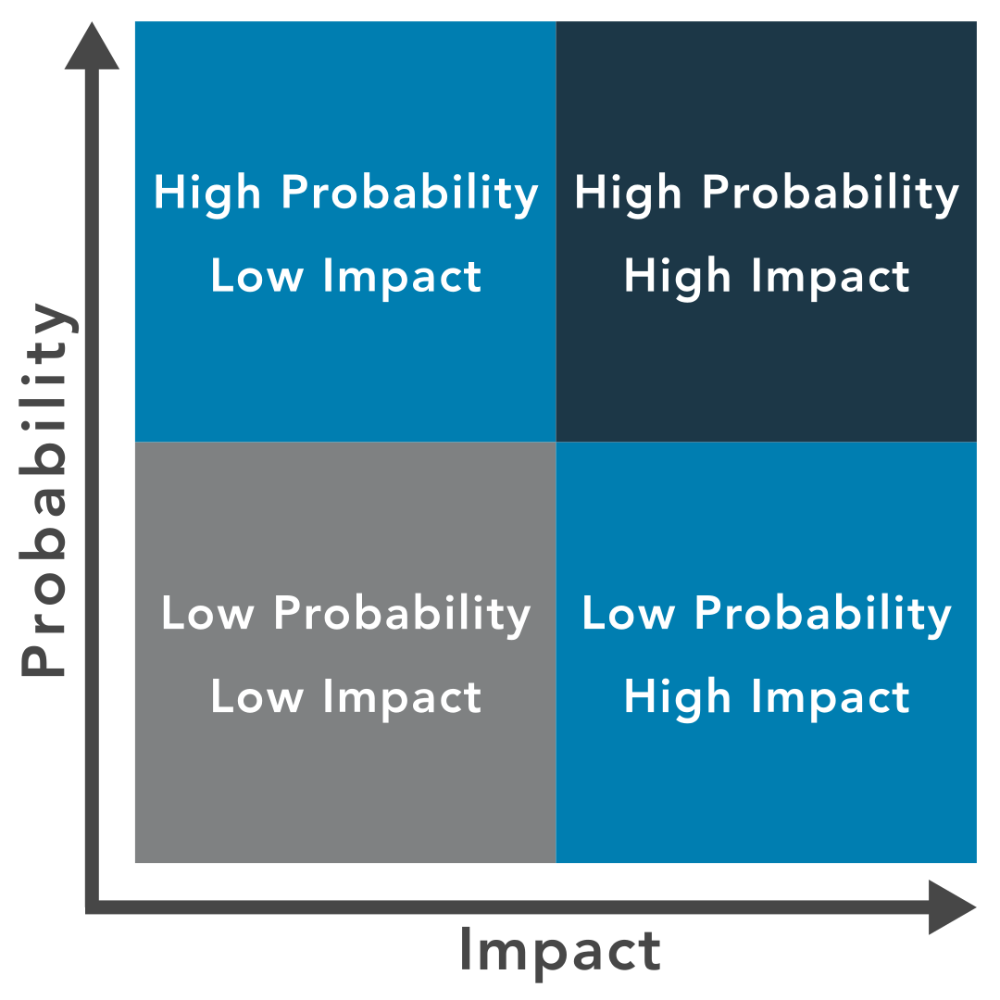

# Risk Priorities
when risks are identified it is time to prioritize and analyze core risks, which will help determine the root cause and narrow down apparent and core risks.

## Qualitative Risk Analysis
A method of risk analysis that is based on assigning risk descriptor like low, medium or high 

## Quantitative Risk Analysis
A method of risk analysis that is based on assigning numerical values to the risk

One effective method to prioritize risk is to use a risk matrix

For instance, risk with a low likelihood of occurance and impact results in low priority
